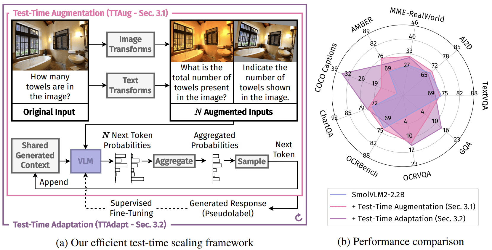

<p align="center">
<h1 align="center"><strong>Efficient Test-Time Scaling for Small Vision-Language Models</strong></h1>
  <p align="center">
    <em><a href="https://monurcan.github.io/">Mehmet Onurcan Kaya</a><sup>1,2</sup>, <a href="https://elliottd.github.io/">Desmond Elliott</a><sup>3,2</sup>, <a href="https://dimipapa.github.io/">Dim P. Papadopoulos</a><sup>1,2</sup></em>
  </p>
  <p align="center">
    <em><sup>1</sup> Technical University of Denmark &nbsp;&nbsp;&nbsp; <sup>2</sup> Pioneer Center for AI &nbsp;&nbsp;&nbsp; <sup>3</sup> University of Copenhagen</em>
  </p>
</p>

<div id="top" align="center">

[](http://arxiv.org/abs/xxxx.xxxxx)
[](https://monurcan.github.io/efficient_test_time_scaling/)
[](https://monurcan.github.io/efficient_test_time_scaling/)

</div>

<div align="center">
    
</div>

Our framework consists of two main pipelines: (1) Test-Time Augmentation: Given an input image and text prompt, we apply various transformations to create multiple augmented versions. VLM processes each augmented input to produce next token probability distributions, which are then aggregated at the token level to generate the final response. (2) Test-Time Adaptation: We create pseudolabels through test-time augmentation and fine-tune the VLM parameters, then repeat the process.  Both methods demonstrate effectiveness across nine diverse benchmarks as shown in (b).

## 🔎 Abstract
Small Vision-Language Models (VLMs) provide a computationally efficient alternative to larger models, at the cost of weaker generalization abilities and downstream task performance. These shortcomings could be addressed by test-time scaling techniques, but existing methods are typically computationally demanding, contradicting the resource-efficient design goals of small models. To address these limitations, we propose two novel and efficient test-time scaling strategies that leverage the model-internal features rather than external supervision: (i) Test-Time Augmentation (TTAug), which generates multiple augmented inputs and aggregates outputs at the token level without parameter updates, and (ii) Test-Time Adaptation (TTAdapt), which adapts model parameters during inference using consensus-based pseudolabels from TTAug. Through extensive experiments across nine benchmarks, we demonstrate consistent performance improvements while maintaining computational efficiency suitable for resource-constrained environments. The generality of our approach is demonstrated both within models at different scales and across different VLMs without additional tuning.


## 🔧 Installation
```bash
git clone https://github.com/monurcan/efficient_test_time_scaling.git
cd efficient_test_time_scaling
python3 -m venv .venv
source .venv/bin/activate
pip install -r requirements.txt --no-deps
pip install -e . --no-deps
```

Note that the code has been tested with Python 3.10.12 and CUDA 12.5.

## 💻 Inference: Run an Experiment
```bash
bash scripts/benchmark.sh benchmark_configs/test_config.json
```
This will execute the experiment configuration defined in [`benchmark_configs/test_config.json`](./benchmark_configs/test_config.json).

For customizing experiments, refer to the configuration system documentation: [`docs/en/ConfigSystem.md`](./docs/en/ConfigSystem.md)

Results will be automatically saved to the [`benchmark_results`](./benchmark_results) directory as specified in [`scripts/benchmark.sh`](./scripts/benchmark.sh).

## 🚀 Development
The core logic of our methods is located in [`vlmeval/vlm/tta`](./vlmeval/vlm/tta)

Utility scripts for analysis and visualization are available in [`scripts`](./scripts):
- [`figure_create.ipynb`](./scripts/figure_create.ipynb) - Figure generation, saves the following visualizations to [`benchmark_visualizations`](./benchmark_visualizations) directory
- [`table_create.ipynb`](./scripts/table_create.ipynb) - Results table generation

## 🙏 Acknowledgement
This project builds upon [VLMEvalKit](https://github.com/open-compass/VLMEvalKit).
For more details, refer to [`README_VLMEVALKIT.md`](./README_VLMEVALKIT.md).

## 📚 Citation
```
@article{Kaya2025EfficientTTS,
  title={Efficient Test-Time Scaling for Small Vision-Language Models},
  author={Mehmet Onurcan Kaya and Desmond Elliott and Dim P. Papadopoulos},
  journal={arXiv preprint arXiv:ARXIV PAPER ID},
  year={2025},
  url={https://monurcan.github.io/efficient_test_time_scaling}
}
```

## 💬 Contact
For questions, please open an issue or contact me at monka@dtu.dk